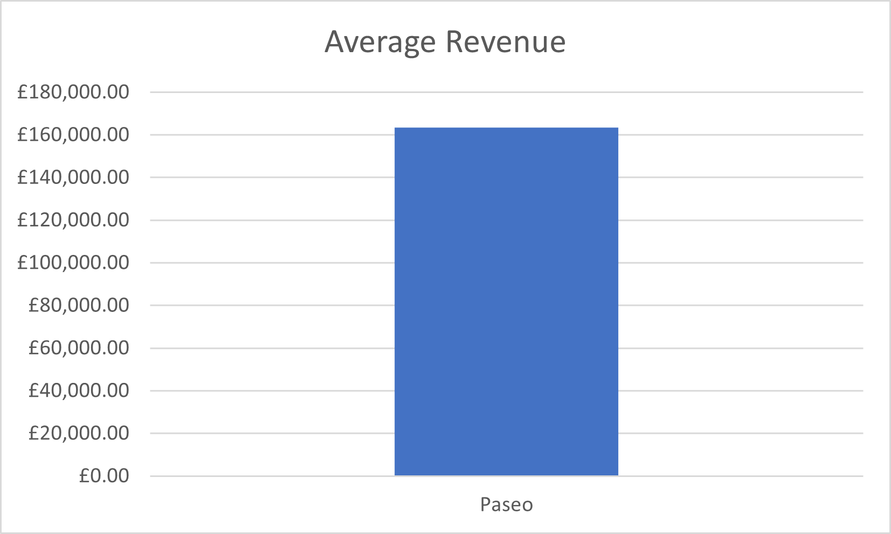
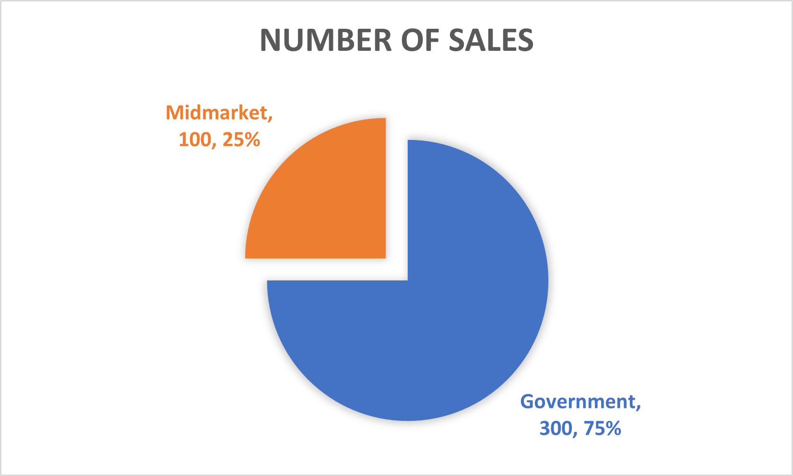
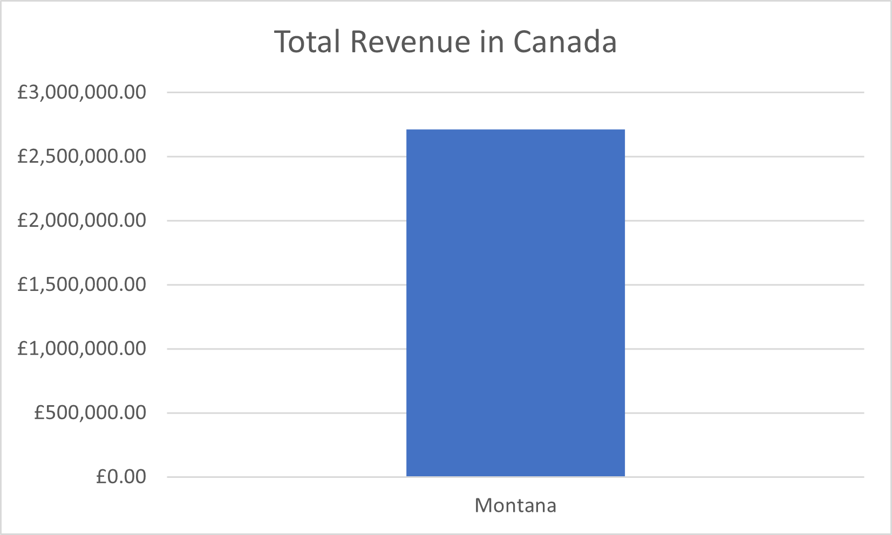
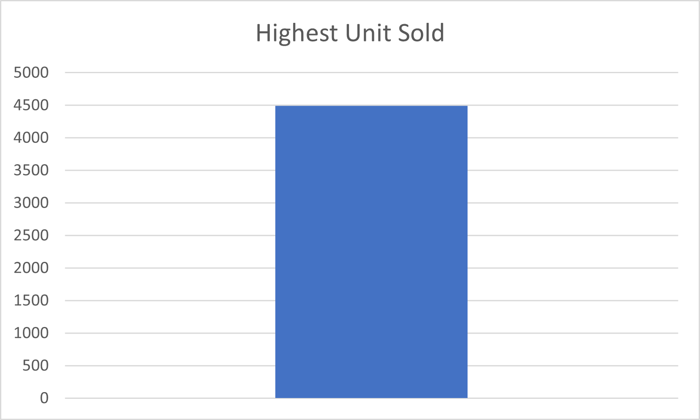
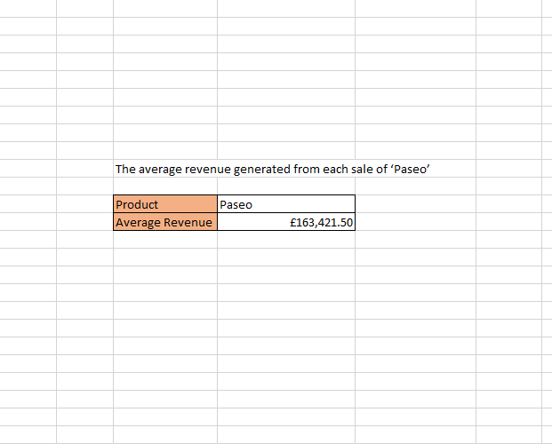
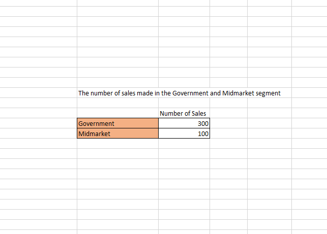
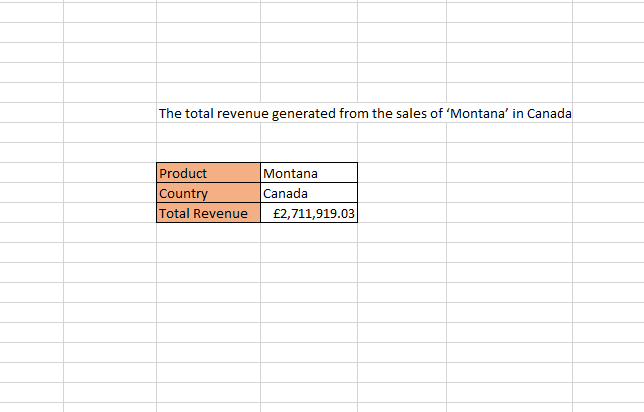
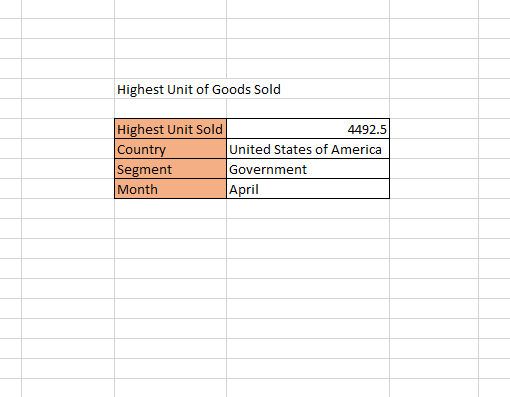
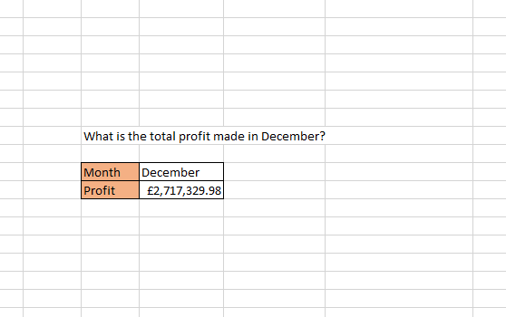

# **Data Analytics Project: Sales Data Analysis**

## **Introduction:**

- **Project Title: Sales Data Analysis**

- **Project Objectives:**
The primary objective of this analysis is to gain actionable insights from the sales data to make informed business decisions and improve overall performance. The analysis will focus on exploring various aspects of the sales dataset, including product-specific revenue, sales distribution across different market segments and countries, identifying top-performing products, understanding seasonal trends, and determining the most profitable periods. By conducting exploratory data analysis (EDA) on the sales data, we aim to uncover patterns, trends, and potential opportunities to optimize sales strategies, increase revenue, and enhance profitability.

- **Data Source:**
The sales data used for this analysis was collected from my data analysis tutor. The dataset includes information on sales transactions, product names, market segments, countries, months, revenue generated, units sold, and profit earned. The data encompasses a specific period, allowing us to perform a comprehensive examination of sales performance during this timeframe. 

With the objectives set, and the data source specified, this sales data analysis aims to provide valuable insights that can be leveraged to make data-driven decisions, optimize sales strategies, and foster business growth.

## **Data Cleaning and Preparation:**
Prior to conducting the analysis, the data was cleansed, organized, and prepared for exploration to ensure data integrity and accuracy.

## **Exploratory Data Analysis (EDA):**

**Data Overview:**
The dataset used for this exploratory data analysis (EDA) comprises sales data for various products, segments, countries, and months. The dataset contains multiple columns, including:
- Product: The name of the product being sold.
- Segment: The market segment to which the sales belong (e.g., Government, Midmarket).
- Country: The country where the sales were made.
- Month: The month in which the sales occurred.
- Revenue: The revenue generated from each sale.
- Units Sold: The number of units sold for each transaction.
- Profit: The profit earned from each sale.

The dataset spans a specific time frame, allowing us to explore trends, patterns, and performance metrics related to different products, market segments, countries, and months.

**Key Metrics:**
To gain insights into the data and understand its characteristics, we present the following key metrics and visualizations:

1. **Average Revenue per Sale of 'Paseo':**
   - Metric: Average revenue generated from the sales of the 'Paseo' product.
   - Visualization: A bar chart showing the average revenue for each sale of the 'Paseo' product, providing an overview of its revenue-generating performance.
   

2. **Number of Sales in Government and Midmarket:**
   - Metric: The count of sales in the 'Government' and 'Midmarket' segments.
   - Visualization: A pie chart or bar chart comparing the number of sales in the two segments, allowing for a quick comparison of their sales volumes.
   

3. **Total Revenue from Sales of 'Montana' in Canada:**
   - Metric: Total revenue generated from the sales of the 'Montana' product in Canada.
   - Visualization: A bar chart representing the total revenue contribution of the 'Montana' product in Canada, enabling us to identify its significance in the Canadian market.
   

4. **Highest Unit of Goods Sold:**
   - Metric: The highest volume of goods sold and the corresponding country, segment, and month.
   - Visualization: A combination of bar charts and tables showcasing the highest units sold and the associated details, aiding in identifying the peak performing transaction.
     

5. **Monthly Profit Analysis:**
   - Metric: Total profit made in each month.
   - Visualization: A bar chart illustrating the monthly profit trends, helping us identify the most profitable months and fluctuations over time.
   

By analyzing these key metrics and visualizations, we can gain valuable insights into sales performance, revenue generation, and profit trends, thereby facilitating informed decision-making and strategic planning for business improvement.

## **Average Revenue per Sale of 'Paseo':**

To calculate the average revenue per sale for the 'Paseo' product, we followed the steps below:

1. **Create a table containing the product data:** We first organized the sales data in a table format, ensuring that it includes the product names, revenue generated, and other relevant information.

2. **Select the cell for displaying the average revenue for 'Paseo':** Next, we identified a cell where we wanted to display the average revenue for the 'Paseo' product.

3. **Calculate the Average Sale:** To compute the average revenue from the sales of the 'Paseo' product, we utilized Excel's built-in function `=ROUND(AVERAGEIF($C$2:$C$701, "Paseo", J2:J701), 2)`. This function performs the following steps:
   - `AVERAGEIF($C$2:$C$701, "Paseo", J2:J701)`: This part of the formula calculates the average revenue of all sales corresponding to the product name "Paseo" (located in column C) by summing up the revenue (located in column J) and dividing it by the number of 'Paseo' sales.
   - `ROUND(average_value, 2)`: This ensures that the final result is rounded to two decimal places.

**Result:** The analysis reveals that the average revenue generated from the sales of 'Paseo' is £163,421.50. Refer to the image below for a visual representation of the data:

## **Number of Sales in Government and Midmarket:**

To determine the number of sales in the 'Government' and 'Midmarket' segments, we employed the `=COUNTIF()` function as outlined below:

1. **Select cells for displaying the count of sales:** Initially, we chose two cells, one for each segment ('Government' and 'Midmarket'), where we wanted to display the count of sales.

2. **Enter the COUNTIF formula for each segment:** The formula syntax for counting instances that match a specific criterion is `=COUNTIF(range, criteria)`. We applied the following formulas:
   - For 'Government': `=COUNTIF(A2:A701, "Government")`
   - For 'Midmarket': `=COUNTIF(A2:A701, "Midmarket")`

Here, the 'range' argument represents the cells in the "Segment" column containing segment values, and the 'criteria' argument represents the specific segment name ("Government" or "Midmarket").

**Result:** Our analysis indicates that there were 300 sales in the 'Government' segment and 100 sales in the 'Midmarket' segment. See the image below for a visual representation of the data:

## **Total Revenue from Sales of 'Montana' in Canada:**

To calculate the total revenue from the sales of the 'Montana' product in Canada, we utilized the `SUMIFS()` function as follows:

1. **Create a table for the relevant data:** Initially, we organized the sales data in a table format, ensuring it includes the product names, countries, revenue generated, and other relevant information.

2. **Select the cell for displaying the total revenue:** Next, we identified a cell where we wanted to display the total revenue from the sales of 'Montana' in Canada.

3. **Enter the SUMIFS formula:** The formula syntax for using multiple criteria to sum values is `=SUMIFS(sum_range, range_criteria1, criteria1, range_criteria2, criteria2, ...)`. We applied the following formula:
   - `=SUMIFS(J2:J701, C2:C701, "Montana", B2:B701, "Canada")`

Here, the 'sum_range' represents the revenue column from our sales dataset, 'range_criteria1' represents the product column, and 'range_criteria2' represents the country column. The 'criteria1' and 'criteria2' arguments specify the specific product name ("Montana") and country ("Canada") we are interested in.

**Result:** The analysis reveals that the total revenue generated from the sales of the 'Montana' product in Canada amounted to £2,711,919.03. Refer to the image below for a visual representation of the data:

## **Highest Unit of Goods Sold:**

To identify the country, segment, and month with the highest units of goods sold, we followed the steps below:

1. **Get the highest unit of goods sold using the MAX Function:** We initially calculated the highest unit of goods sold using Excel's MAX function. The steps were as follows:
   - **Select a cell for displaying the highest unit of goods sold:** We identified a cell where we wanted to display the highest unit of goods sold.
   - **Enter the MAX formula:** The formula syntax for finding the maximum value in a range is `=MAX(range)`. We applied the formula as follows:
   - `=MAX(E2:E701)`

Here, 'E2:E701' represents the cells in the "Units Sold" column.

2. **Use the XLOOKUP function to find corresponding details:** To determine the country, segment, and month with the highest units of goods sold, we employed Excel's XLOOKUP function. The steps were as follows:
   - **Select cells for displaying the details:** We identified cells where we wanted to display the country, segment, and month with the highest units of goods sold.
   - **Enter the XLOOKUP formula:** The formula syntax for using XLOOKUP is `=XLOOKUP(lookup_value, lookup_array, return_array)`. We applied the following formulas:
   - For 'Country': `=XLOOKUP(F2, E2:E701, A2:A701)`
   - For 'Segment': `=XLOOKUP(F2, E2:E701, C2:C701)`
   - For 'Month': `=XLOOKUP(F2, E2:E701, D2:D701)`

Here, 'F2' contains the previously calculated highest unit of goods sold, and 'E2:E701' is the range of cells in the "Units Sold" column. 'A2:A701', 'C2:C701', and 'D2:D701' represent the ranges for the "Country," "Segment," and "Month" columns, respectively.

**Result:** Our analysis shows that the highest volume of goods sold was 4492.5 units, and this transaction occurred in the United States of America within the government segment during the month of April. Refer to the image below for a visual representation of the data:

## **Monthly Profit Analysis:**

To calculate the total profit for the month of December, we used the `SUMIF()` function as outlined below:

1. **Create a table containing the month data:** We first organized the sales data in a table format, ensuring that it includes the months, profits generated, and other relevant information.

2. **Select the cell for displaying the total profit for December:** Next, we identified a cell where we wanted to display the total profit for the month of December.

3. **Enter the SUMIF formula:** The formula syntax for summing values based on a single criterion is `=

SUMIF(range_criteria, criteria_cell, sum_range)`. We applied the following formula:
   - `=SUMIF(A2:A701, "December", J2:J701)`

Here, 'A2:A701' represents the cells in the "Month" column containing the month values, "December" is the specific month we are interested in, and 'J2:J701' is the profit column from our sales dataset.

**Result:** The analysis shows that the total profit made in the month of December is £2,717,329.98. Refer to the image below for a visual representation of the data:

---

  
## **Conclusion:**

Summary:
The data analysis focused on various aspects of sales and revenue for different products, segments, countries, and months. Key findings from the analysis are as follows:

1. Average Revenue per Sale of 'Paseo':
   - The average revenue generated from the sales of the 'Paseo' product was found to be £163,421.50. This figure serves as a crucial metric for understanding the performance of the product in generating revenue.

2. Number of Sales in Government and Midmarket:
   - The analysis revealed that there were 300 sales in the 'Government' segment and 100 sales in the 'Midmarket' segment. This information helps in assessing the sales performance of these two segments.

3. Total Revenue from Sales of 'Montana' in Canada:
   - The total revenue generated from the sales of the 'Montana' product in Canada amounted to £2,711,919.03. This insight highlights the significance of the Canadian market for the 'Montana' product.

4. Highest Unit of Goods Sold:
   - The highest volume of goods sold was 4492.5 units, and this transaction occurred in the United States of America within the government segment during the month of April. This finding is crucial for understanding peak sales performance and optimizing inventory management.

5. Monthly Profit Analysis:
   - The total profit made in the month of December amounted to £2,717,329.98. This analysis provides valuable insights into the profitability of the business during this particular month.

Recommendations:
Based on the analysis, the following actionable recommendations are proposed:

1. **Paseo Product Enhancement:** Considering the average revenue per sale for the 'Paseo' product, it may be worthwhile to invest in product enhancements, marketing strategies, or targeted promotions to further boost sales and revenue.

2. **Focus on Government Segment:** The 'Government' segment has significantly more sales compared to the 'Midmarket' segment. Focusing on strategies to retain and expand the government clientele could yield favorable results.

3. **Canada Market Penetration:** Given the substantial revenue generated from the sales of the 'Montana' product in Canada, exploring further market penetration strategies and understanding the preferences of Canadian customers could lead to increased sales and market share.

4. **Leverage Success in April:** Since April witnessed the highest unit of goods sold, it may be beneficial to study the factors contributing to this peak performance and replicate successful strategies during similar periods.

5. **Maximize December Profits:** Analyzing the sources of high profits in December can help identify products or regions that perform exceptionally well during this period, allowing the business to focus on those areas and capitalize on the seasonal demand.

Limitations:
During the course of the project, some limitations and challenges were encountered:

1. **Data Completeness:** The analysis relied on the available data, and any missing or incomplete data points may have affected the accuracy of the results.

2. **Assumptions:** Certain assumptions were made during the analysis, such as using specific criteria for segmenting and categorizing data. These assumptions may have introduced some degree of subjectivity.

3. **Data Scope:** The analysis was conducted on a specific dataset with a limited timeframe, which may not fully capture the dynamics and trends that could emerge over a more extended period.

4. **External Factors:** The analysis does not account for external factors, such as market trends, economic conditions, or competitor activities, which could influence sales and revenue performance.

Despite these limitations, the analysis provides valuable insights that can guide decision-making and strategic planning to enhance sales, revenue, and overall business performance.

