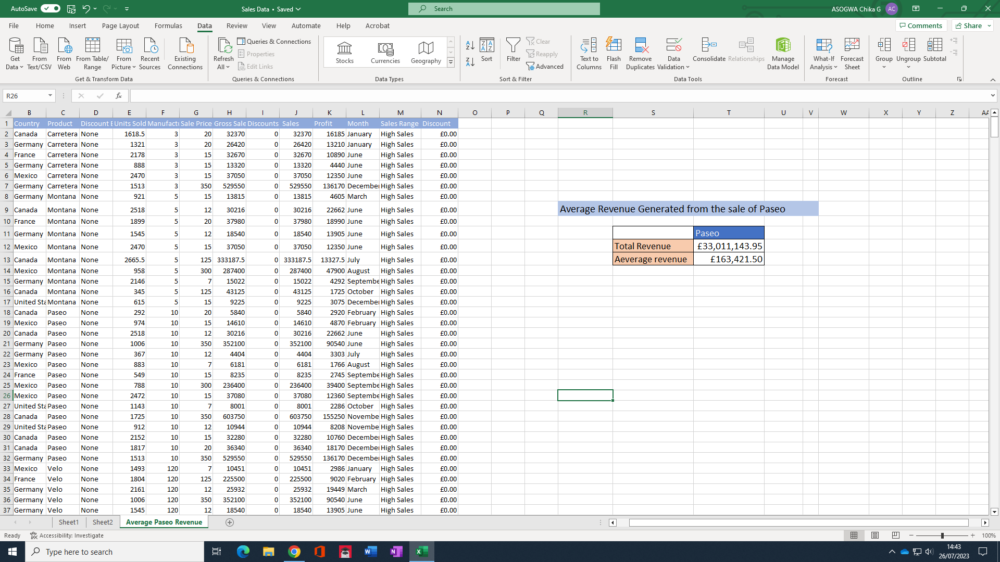
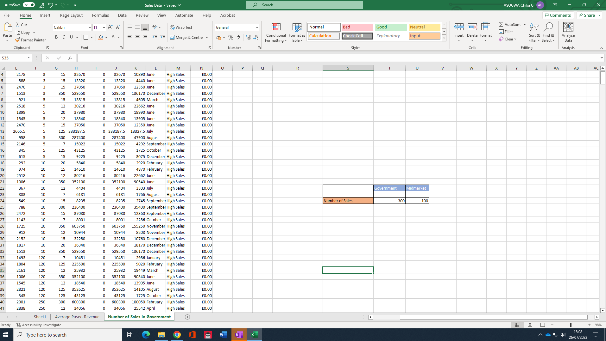
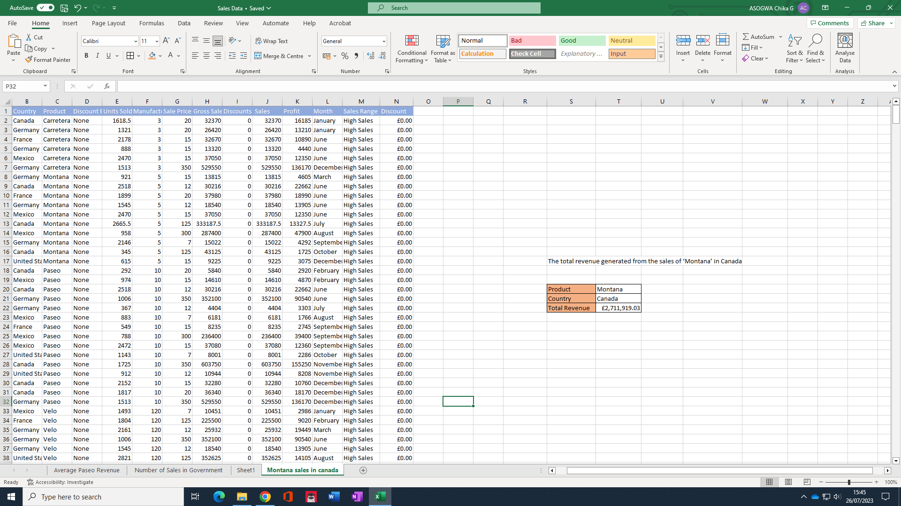

# **Data Analytics Project: Sales Data Analysis**

**1. Introduction:**
- Project Title: Sales Data Analysis
- Project Objectives: [Describe the objectives of the analysis]
- Data Source: [Specify the source of the sales data]

**2. Data Cleaning and Preparation:**
- Data Cleaning Steps: [Explain the process of data cleaning, handling missing values, and removing duplicates]
- Data Transformation: [Describe any data transformations or feature engineering performed]

**3. Exploratory Data Analysis (EDA):**
- Data Overview: [Provide a brief overview of the dataset]
- Key Metrics: [Present the key metrics and visualizations to understand the data]

## **Average Revenue per Sale of 'Paseo':**
To calculate the average sale for a specific product when there are multiple products, we used Excel's built-in functions. Below is the step-by-step explanation of the process:

- Create a table that contain the product we want to analyse.
- Select a cell where you want to display the average revenue for Paseo.
- Calculate Average Sale: We calculated the average revenue generated from the sales of the specific product using the ```=ROUND(AVERAGEIF($C$2:$C$701,T11, J2:J701), 2)``` function in Excel, These function sum up the revenue column for particular product 'Paseo' and divided the total revenue by the number of sales to get the average sale value for the particular product.

- Result: Our analysis show that the average reneue generated from the sales of Paseo is £163,421.50.
  

## **Number of Sales in Government and Midmarket:**
To calculate the number of sale in Government and Midmarket segment, we used ```=COUNTIF()``` function:

- Select a cell where you want to display the count of sales in the Government segment.
- Enter the COUNTIF formula in the cell. The formula syntax is: =COUNTIF(range, criteria).
- For the "range" argument, select the cells in the "Segment" column containing the segment values.
- For the "criteria" argument, enter "Government" (enclosed in double quotes as it is a text value) ```=COUNTIF(A2:A701, "Government")```.
- Repeat the above process fo Midmarket Segment.
- Result: Our Analysis shows that the number of sales in the Government segment is 300 while that of Midmarket is 100.
 

## **Total Revenue from Sales of 'Montana' in Canada:**
To calculate the total Revenue from Sales of 'Montana' in Canada we used the SUMIFS() Function for 'Montana' Product in Canada:

- Create a table for the product, country we want to analyse.
- Select a cell where you want to display the total revenue for 'Montana' sales in Canada.
- Enter the SUMIFS formula in the cell. The formula syntax is: ```=SUMIFS( sum_range, range_criteria 1, criteria 1, range_criteria 2, criteria 2,)```.
- Select a sum range to compute the revenue that is sales column from our sales dataset
- Select the product column as criteria 1 range and for the "range_criteria" argument, select the cells in the new table containing product name.
- repeat the above process for criteria 2 and press enter
- Result: The total revenue generated from the sale of Montana product's, in Canada, amounted to £2,711,919.03.
  

## **Highest Unit of Goods Sold:**
To identify the country, segment, and month with the highest unit of goods sold, first we need to get the highest unit of goods sold using Excel's MAX Function to Find the Highest Unit Sold:
- Select a cell where you want to display the highest unit of goods sold.
- Enter the MAX formula in the cell. The formula syntax is: =MAX(range).
- For the "range" argument, select the cells in the "Units Sold" column.
  
To determine the country, segment, and month with the highest unit of goods sold, we used Excel's XLOOKUP function, which allows for more powerful and flexible searches. Below is the step-by-step explanation of the process:
- Select a cell where you want to display the country.
- Enter the XLOOKUP formula in the cell. The formula syntax is: =XLOOKUP(highest_units_sold, range_of_units_sold, country_range).
- This will return the country corresponding to the highest unit of goods sold.
- Repeat the process for segment and month.

The Result of our analysis is as follow:
- Result: Our analysis shows that the highest volume of goods sold was 4492.5 units, and this transaction occurred in the United States of America within the government segment during the month of April.
  
## **Monthly Profit Analysis:**
- Calculation: [Explain how you calculated the profit for each sale and the total profit for each month]
- Result: [Present the total profit made in December]

**9. Conclusion:**
- Summary: [Summarize the key findings and insights from the analysis]
- Recommendations: [Provide actionable recommendations based on the analysis]
- Limitations: [Address any limitations or challenges encountered during the project]

**10. Future Work:**
- Future Analysis: [Suggest possible future analysis or improvements to the project]
- Additional Data: [Identify additional data that could enhance the insights gained]

**11. References:**
- Data Source: [List the source of the sales data]
- External Resources: [Include any external resources referenced in the analysis]

